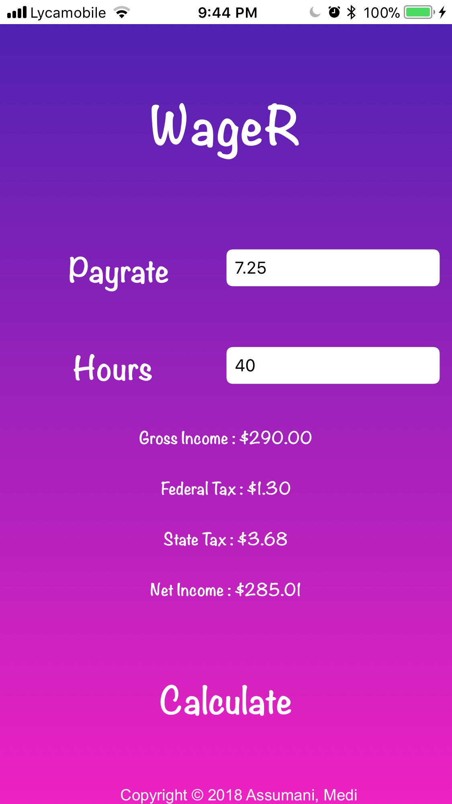

# WageR
Notice : App Mainly created for Saint Peter's Universty Work Studies but can be used for other WS in New Jersey

### Developer : Medi W. Aassumani
### Technology : Swift 4, Xcode9
### Main Purpose : Getting an accurate Paycheck Description a week before payday

Most Colleege federal work studies get their paycheck an entire <i>week</i> after the work cycle is over. For example, If your time entries were submitted a monday, you will receive your paycheck next tuesday. To have a better insight , plan ahead, and know how you'll manage your paycheck. My iOS application calculates the students bi-weekly income accuratly before tax and after taxes. This will help students to plan ahead how they will spend or manage their money.

# Behind-the-scenes goals of this App :

* Getting more familiar with xcode 9
* Mastering iOS fundamental Autolayout concepts : Stackviews and Constrains
* Integretting iOS M-V-C Architecture
* Getting more comfortable with Swift (espacially structs and optionals)

  

